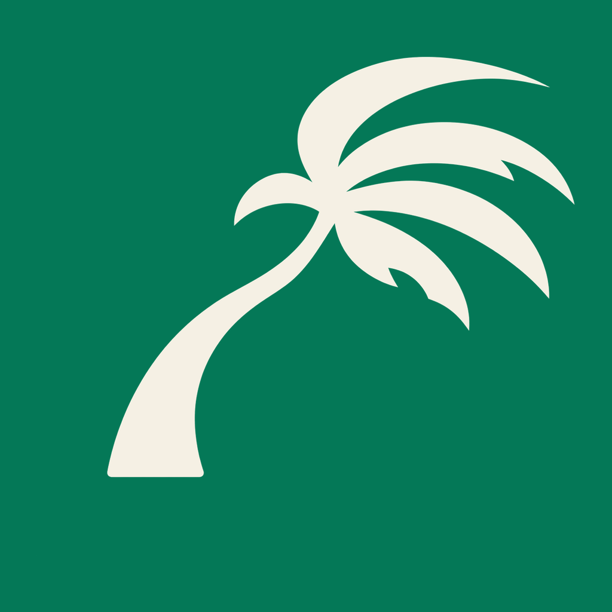
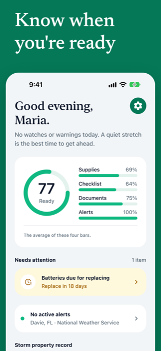
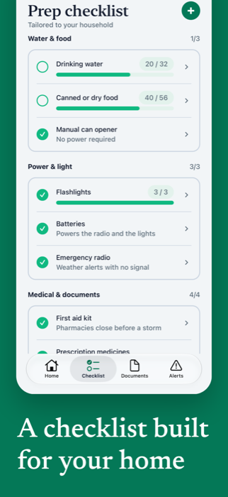
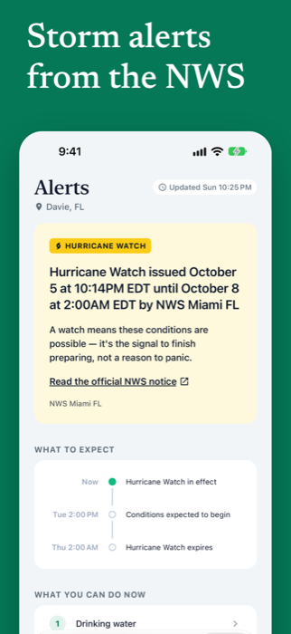
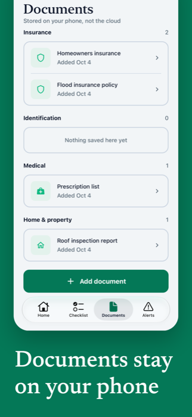
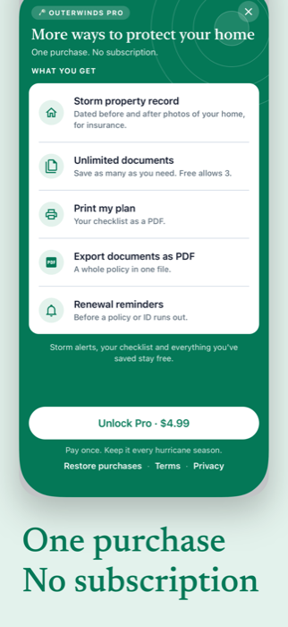

  

<h1 align="center">Outerwinds</h1>

<em>Storm and hurricane prep for your household. Works offline.</em>

  
  
  
  
  

Outerwinds helps households across the US get ready for hurricanes and major storms. It builds a checklist for your home, tracks your supplies and important documents, and sends a push notification when the National Weather Service issues a hurricane, tropical storm, storm surge or flash flood watch or warning for your area. Everything you save works with no signal.

## Screenshots

  
  
  
  
  

## Features

- [x] Personalized checklist built from your household profile
- [x] Readiness score on Home
- [x] Supply inventory with quantities, photos and expiration dates
- [x] Expiration reminders (30 days and 7 days before)
- [x] Live NWS storm watches and warnings, cached for offline
- [x] Push notifications for new watches and warnings, including Time Sensitive delivery
- [x] Document vault with camera and photo import
- [x] Pro (one-time purchase): storm property record, unlimited documents, printable plan, PDF export
- [x] Light and dark mode

## Why I Built It

I'm an iOS developer (Swift and SwiftUI) and wanted to learn React Native, a framework that lets one codebase run on both iOS and Android. Outerwinds is my first React Native app. It launches on the App Store first, and I tested it on Android along the way.

## Tech Stack

| Layer | Technology |
|-------|------------|
| App | React Native, Expo SDK 57, TypeScript |
| Navigation | Expo Router |
| Local data | expo-sqlite |
| Backend | Supabase (storm alerts) |
| Push | Expo Push Notifications (APNs) |
| Weather | National Weather Service API |
| Purchases | RevenueCat |
| Builds | EAS Build |

## Privacy Policy

[Privacy Policy](https://imaryanl.github.io/Outerwinds/privacy.html) · [Support](https://imaryanl.github.io/Outerwinds/support.html)

## Contact

Built by **Aryan Lakhani**

